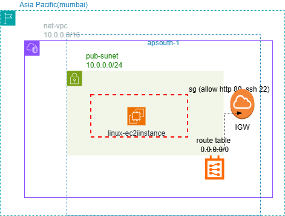

# aws-vpc-ec2-architecture
Custom AWS VPC architecture with public subnet, Internet Gateway, route table, security group, and EC2 instance. Includes network diagram built using draw.io for understanding basic AWS networking.

# 🚀 AWS VPC + EC2 Architecture

A complete and beginner-friendly AWS networking project designed to understand VPC, Subnet, Route Tables, Internet Gateway, Security Groups, and EC2 setup.  
Built using **AWS Console + Draw.io**, perfect for learning and portfolio demonstration.

---

## 🏗️ Architecture Diagram


---

## 📂 Project Structure

```
root/
│
├── diagrams/                     # All VPC, EC2 & networking images
│   ├── aws-vpc-ec2-architecture.png
│   ├── ec2-instance-running.png
│   ├── internet-gateway.png
│   ├── route-table-created.png
│   ├── route-table-subnet-association.png
│   ├── subnet-created.png
│   ├── vpc-created.png
│   └── nginx-service-running.png
│
├── docs/
│   └── architecture-explanation.md   # Full documentation of the design
│
└── README.md
```


